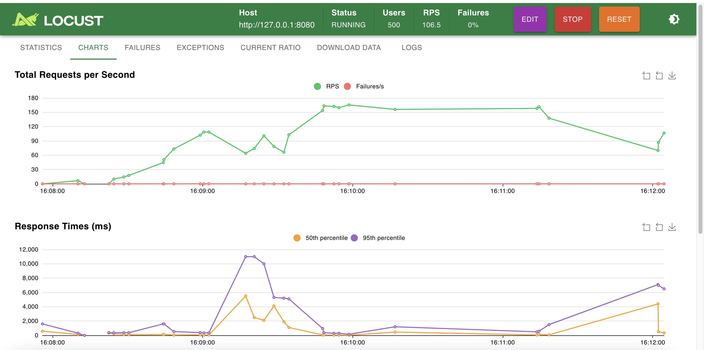
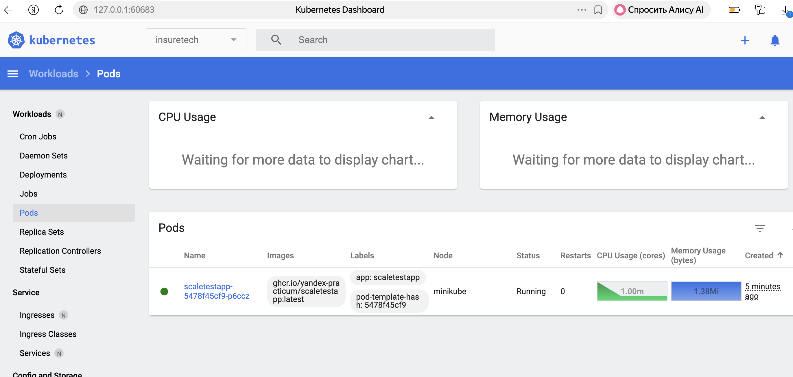
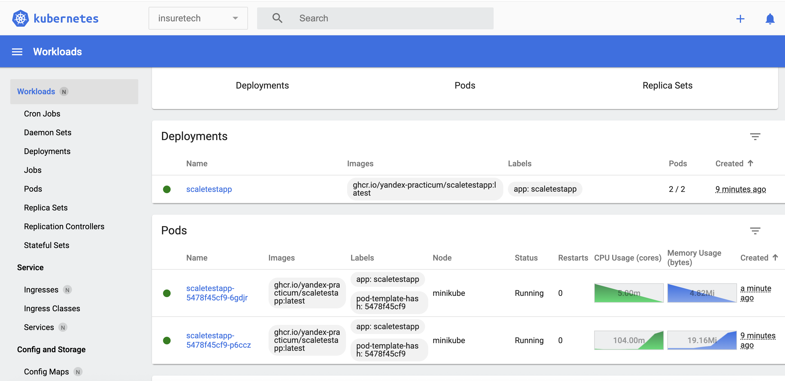
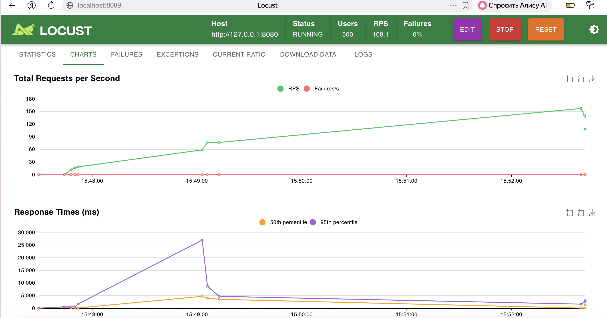
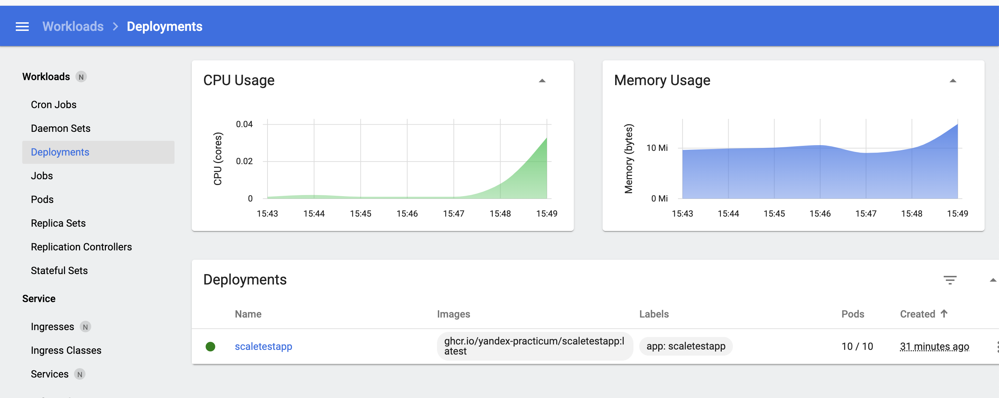
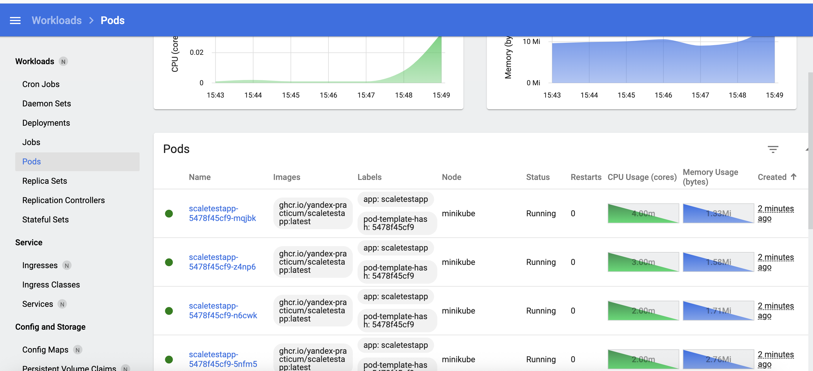
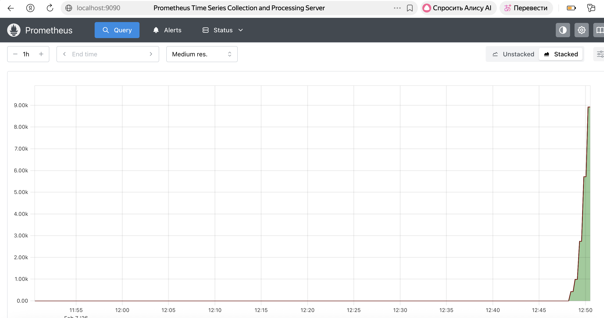

# Часть 1
## Манифесты:
```bash
	kubectl apply -f ./deploy/namespace.yaml
	kubectl apply -f ./deploy/deployment.yaml
	kubectl apply -f ./deploy/service.yaml
	kubectl apply -f ./deploy/hpa.yaml
```
## Изменение реплик под нагрузкой
Number of Users: 500
Ramp up: 10





# Часть 2
## Манифесты:
```bash
	kubectl apply -f ./deploy/namespace.yaml
	kubectl apply -f ./deploy/deployment.yaml
	kubectl apply -f ./deploy/service.yaml
	kubectl apply -f ./deploy/service-monitor.yaml

	helm install prometheus-adapter prometheus-community/prometheus-adapter -n monitoring -f ./deploy/prometheus-adapter.yaml
	kubectl apply -f ./deploy/hpa-rps.yaml
```
Number of Users: 500
Ramp up: 10




