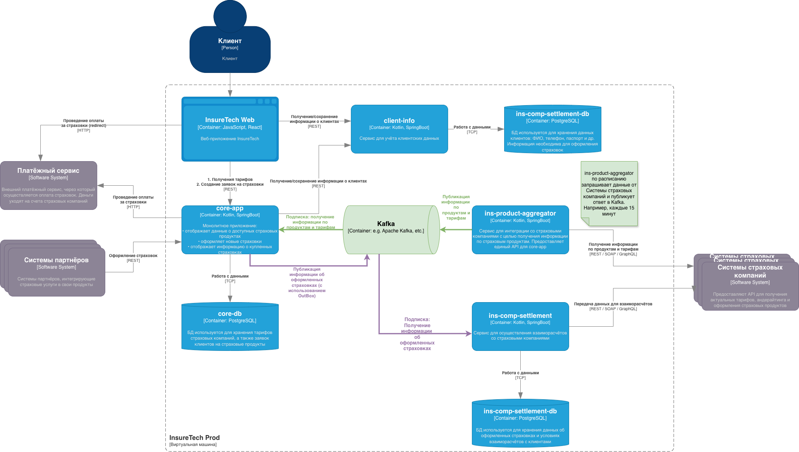

# Описание риском и проблем текущей архитектуры
## As-Is
- ins‑product‑aggregator — агрегатор данных от страховых компаний (5 шт.), работает по REST API, синхронный ответ.

- core‑app — запрашивает данные у aggregator раз в 15 мин, хранит локальную реплику.

- ins‑comp‑settlement — запрашивает данные у aggregator раз в сутки (ночью); также раз в сутки получает от core‑app список оформленных страховок.

## Риски и проблемы
1. Высокая нагрузка на ins‑product‑aggregator при масштабировании.
   1. На текущий момент 5 внешних систем. В ближайшем будущем будет подключено еще 5.
   2. Агрегирует все запросы внешних систем, а это значит задержка ответа при подключении новых системм будет увеличиваться.
   3. Запросы от core‑app и  ins‑comp‑settlement увеличивают нагрузку.
2. Риски недоступности внешних систем.
   1. Из-за недоступности одной из внешних систем результирующий ответ будет неполным или вернет ошибку.
   2. Retry могут усугубить ситуацию из-за долгих ожиданий ответов.
3. Неконсистентность данных -- обновление происходит раз в 15 минут и раз в сутки
4. Синхронное взаимодействие может может завершится ошибкой и синхронизация данных не пройдет.
5. Отсутствие отказоустойчивости при сбоях aggregator -- Если aggregator недоступен, клиенты не получают данные
6. Масштабируемость REST‑взаимодействий -- При увеличении числа СК и клиентов возможны очереди запросов и деградация производительности.

## To-De

   

